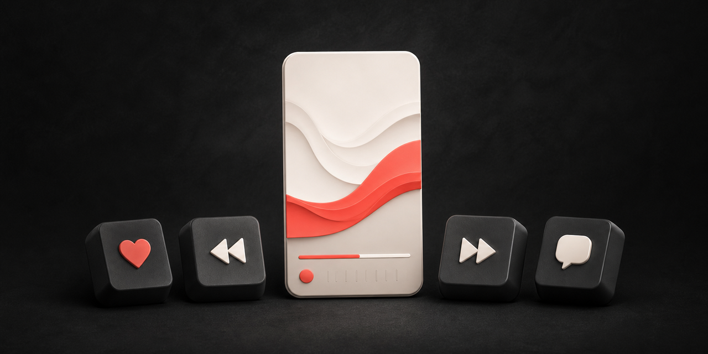
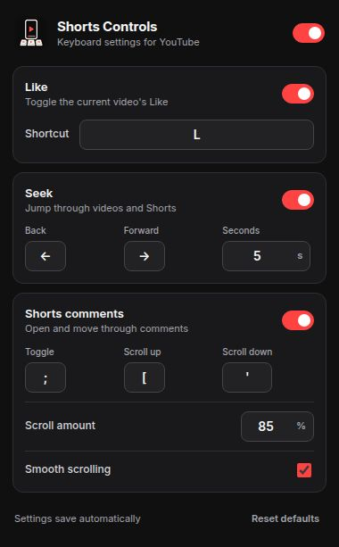

<p align="center">
  
</p>

<h1 align="center">Shorts Keyboard Controls</h1>

<p align="center">
  The keyboard controls YouTube videos and Shorts should already have.
</p>

<p align="center">
  <a href="https://github.com/Asforaa/shorts-keyboard-controls/releases/latest"></a>
  <a href="LICENSE"></a>
  
</p>

## What it does

- Press `L` to like or remove your Like from the current video or Short.
- Press `←` or `→` to seek backward or forward, including in Shorts.
- Press `;` to open or close the Shorts comments panel.
- Press `[` or `'` to scroll up or down inside Shorts comments.
- Change every key, seek duration, scroll amount, and feature toggle from the toolbar popup.
- Ignore shortcuts while you are typing in search, comments, or another text field.
- Show no injected notifications, overlays, analytics, or ads.

## Settings

<p align="center">
  
</p>

Settings save automatically with Chromium's synced extension storage and update open YouTube pages immediately.

| Action | Default |
| --- | --- |
| Like / unlike | `L` |
| Seek backward | `←` |
| Seek forward | `→` |
| Open / close Shorts comments | `;` |
| Scroll comments up | `[` |
| Scroll comments down | `'` |
| Seek distance | 5 seconds |
| Comment scroll distance | 85% of the panel |

The popup prevents duplicate shortcuts. All shortcuts use one key without modifiers.

## Install in Brave

1. Download `shorts-keyboard-controls-v1.3.0.zip` from the [latest release](https://github.com/Asforaa/shorts-keyboard-controls/releases/latest).
2. Extract the ZIP somewhere you will keep it. Do not delete that extracted folder after installation.
3. Open `brave://extensions`.
4. Turn on **Developer mode** in the top-right corner.
5. Click **Load unpacked**.
6. Select the extracted folder containing `manifest.json`.
7. Refresh any open YouTube tabs.

Pin the extension from Brave's extensions menu if you want quick access to its settings.

## Install in Chrome or another Chromium browser

The same unpacked installation works in Chrome, Edge, Vivaldi, and other Chromium browsers:

1. Open the browser's extensions page, such as `chrome://extensions`.
2. Enable **Developer mode**.
3. Choose **Load unpacked**.
4. Select the extracted release folder.

## Updating

1. Download and extract the new release over the old extension folder.
2. Return to your browser's extensions page.
3. Click **Reload** on Shorts Keyboard Controls.
4. Refresh YouTube.

Your customized settings are stored separately by the browser and should remain in place.

## Privacy

Shorts Keyboard Controls has no analytics, servers, accounts, ads, or telemetry. It does not collect or transmit browsing history, video history, comments, account information, or personal data.

The extension requests only Chromium's `storage` permission to save your settings. It runs only on `youtube.com` pages. See [PRIVACY.md](PRIVACY.md) for the complete statement.

## Development

There is no build step and there are no dependencies.

```text
manifest.json   Extension configuration
content.js      YouTube shortcuts and DOM targeting
popup.html      Settings popup markup
popup.css       Settings popup styling
popup.js        Shortcut editing and synced settings
icons/          Extension icon sizes
```

After editing, reload the unpacked extension from your browser's extensions page and refresh YouTube.

## Compatibility note

YouTube changes its page structure regularly. If a shortcut stops working, please [open an issue](https://github.com/Asforaa/shorts-keyboard-controls/issues) with the browser version, the page type (video or Short), and what happened.

This project is unofficial and is not affiliated with, endorsed by, or sponsored by YouTube or Google.

## License

[MIT](LICENSE) © 2026 Asforaa
